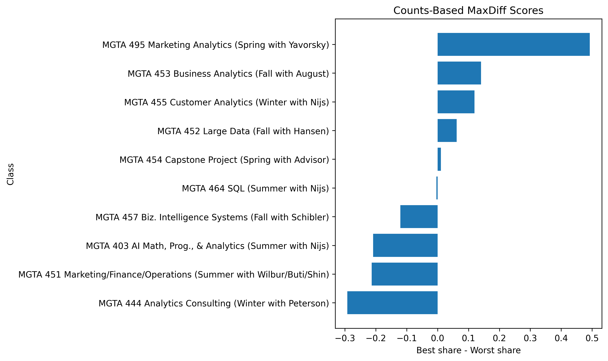
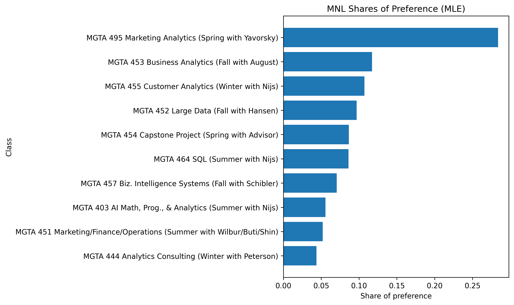
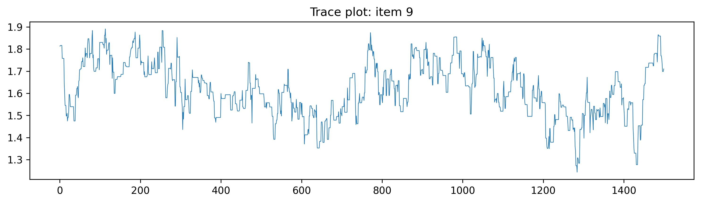
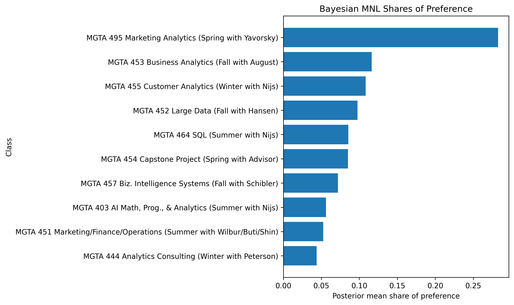
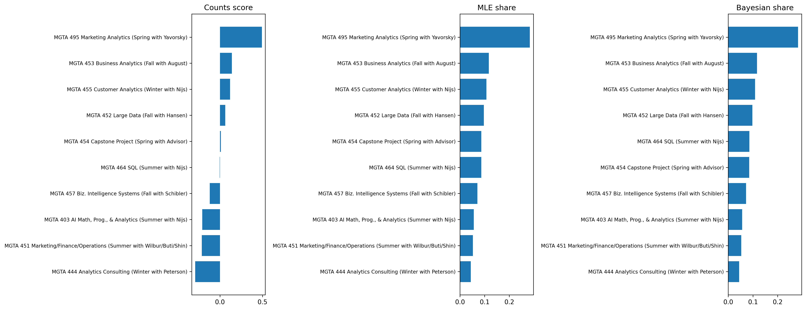

## Introduction

MaxDiff, also called *Best-Worst Scaling*, is a survey method for measuring relative preference. Instead of asking respondents to assign each item a score on a numeric scale, MaxDiff repeatedly shows a small subset of items and asks them to choose the most preferred and least preferred option in that set. This design is attractive because people are usually much better at making trade-offs than at using a 1–10 scale consistently. A respondent may hesitate between giving an item a 7 or an 8, but they can usually tell which option they like most and which they like least in a set of four.

In this assignment, the ten items are the ten core MSBA classes at UCSD Rady. I estimate relative preference for these classes in three ways. First, I compute a simple **counts analysis** based on the percentage of times each class is picked as best minus the percentage of times it is picked as worst. Second, I estimate a **multinomial logit (MNL)** model by **maximum likelihood**. Third, I estimate the same MNL model in a **Bayesian** framework using a Metropolis-Hastings sampler. I expected these three methods to agree on the broad ranking of classes, especially at the top and bottom of the list, while allowing for some small differences in the middle where preferences are closer together.

## The Data

The raw survey file contains one row per displayed item. The key variables are:

- `Record ID`: anonymized respondent identifier
- `Task`: the screen number for that respondent
- `Position`: the slot on the screen
- `Item`: which course appears in that slot
- `Response`: `1` if the item was selected as best, `-1` if selected as worst, and `0` otherwise

The item-label file maps each numeric item code to a course title.

The raw data contain **85 respondents**. A standard four-item MaxDiff task should contain exactly four rows, with one best choice, one worst choice, and two unchosen items. However, after checking the raw file carefully, I found that not all tasks followed this standard format. Some tasks contained four rows, while others contained only two. The raw data also included an extra item code beyond the ten labeled course items.

Because the multinomial logit model in this homework is built for standard four-item MaxDiff tasks, I restricted the analysis to tasks that satisfied three conditions:

1. exactly four displayed items,
2. exactly one best choice,
3. exactly one worst choice.

After cleaning, the usable sample contained **2,720 rows**, corresponding to **680 valid MaxDiff tasks**. The final cleaned data included only the ten labeled MSBA classes. Exposure counts were also very balanced across items, which is what I would hope to see in a well-designed MaxDiff study.

## Counts Analysis

I begin with the simplest descriptive approach. For each class $begin:math:text$j$end:math:text$, I calculate the share of times it was selected as best and the share of times it was selected as worst, conditional on being shown. I then define the counts score as

$$
\text{score}_j = \%\text{best}_j - \%\text{worst}_j.
$$

This score is easy to interpret. A large positive value means that a class is often chosen as best and rarely chosen as worst. A large negative value means the opposite.

### Counts results

| Rank | Item | Class | Shown | Best | Worst | % Best | % Worst | Score |
|---|---:|---|---:|---:|---:|---:|---:|---:|
| 1 | 9 | MGTA 495 Marketing Analytics | 274 | 147 | 12 | 0.5365 | 0.0438 | 0.4927 |
| 2 | 5 | MGTA 453 Business Analytics | 270 | 93 | 55 | 0.3444 | 0.2037 | 0.1407 |
| 3 | 7 | MGTA 455 Customer Analytics | 276 | 104 | 71 | 0.3768 | 0.2572 | 0.1196 |
| 4 | 4 | MGTA 452 Large Data | 276 | 77 | 60 | 0.2790 | 0.2174 | 0.0616 |
| 5 | 8 | MGTA 454 Capstone Project | 272 | 72 | 69 | 0.2647 | 0.2537 | 0.0110 |
| 6 | 2 | MGTA 464 SQL | 274 | 55 | 56 | 0.2007 | 0.2044 | -0.0036 |
| 7 | 10 | MGTA 457 Biz. Intelligence Systems | 266 | 23 | 55 | 0.0865 | 0.2068 | -0.1203 |
| 8 | 1 | MGTA 403 AI Math, Prog., & Analytics | 273 | 33 | 90 | 0.1209 | 0.3297 | -0.2088 |
| 9 | 3 | MGTA 451 Marketing/Finance/Operations | 272 | 43 | 101 | 0.1581 | 0.3713 | -0.2132 |
| 10 | 6 | MGTA 444 Analytics Consulting | 267 | 33 | 111 | 0.1236 | 0.4157 | -0.2921 |

The counts analysis already reveals a clear ranking. **MGTA 495 Marketing Analytics** is the dominant favorite by a large margin. **MGTA 453 Business Analytics** and **MGTA 455 Customer Analytics** also receive clearly positive scores, so they appear to be strong favorites as well. At the opposite end, **MGTA 444 Analytics Consulting** is the least attractive course in the counts analysis, followed by **MGTA 451 Marketing/Finance/Operations** and **MGTA 403 AI Math, Programming, & Analytics**. Even before fitting a formal model, the preferences are far from uniform.

## From MaxDiff Data to MNL Choices

To move beyond descriptive counts, I interpret the MaxDiff survey as a discrete-choice problem. On each screen, the respondent first chooses the **best** item from the four shown alternatives. Conditional on that best choice, the respondent then chooses the **worst** item from the remaining three.

If the set of shown items is $begin:math:text$\\\{a\,b\,c\,d\\\}$end:math:text$ and item $begin:math:text$b$end:math:text$ is selected as best, the MNL probability of that choice is

$$
P(\text{best}=b)
=
\frac{\exp(\beta_b)}
{\exp(\beta_a)+\exp(\beta_b)+\exp(\beta_c)+\exp(\beta_d)}.
$$

If item $begin:math:text$c$end:math:text$ is then chosen as worst from the remaining options, I model that worst choice by flipping the sign of utility:

$$
P(\text{worst}=c \mid \text{best}=b)
=
\frac{\exp(-\beta_c)}
{\sum_{j \in \{a,c,d\}} \exp(-\beta_j)}.
$$

This means that each MaxDiff task contributes **two linked MNL observations**: one for the best choice and one for the worst choice conditional on the best. Since the softmax is invariant to adding the same constant to every utility parameter, the model is not identified unless one coefficient is fixed. I therefore set one class as the baseline and interpret all remaining coefficients relative to it.

The value of this setup is that it models the choice process explicitly. Every shown item contributes information, not just the one selected as best or worst.

## MNL via Maximum Likelihood

I first estimate the MNL model by maximum likelihood. For each task, the log-likelihood contribution is the log-probability of the observed best choice plus the log-probability of the observed worst choice conditional on the best choice. Summing across tasks gives

$$
\ell(\boldsymbol{\beta})
=
\sum_{\text{tasks}}
\left[
\beta_{j_b^*}
-
\log \sum_{j \in \text{shown}} \exp(\beta_j)
+
(-\beta_{j_w^*})
-
\log \sum_{j \in \text{shown} \setminus \{j_b^*\}} \exp(-\beta_j)
\right].
$$

The optimizer reported some precision loss, which suggests mild numerical instability in the Hessian approximation, but the estimated ranking itself is very stable and closely matches the descriptive evidence.

To make the MLE results easier to interpret, I convert the utility coefficients into **shares of preference**:

$$
\hat{s}_j
=
\frac{\exp(\hat{\beta}_j)}
{\sum_{k=1}^{10} \exp(\hat{\beta}_k)}.
$$

These shares answer the question: *if all ten classes were shown on a single screen, what fraction of choices would each class receive?*

### MLE results

| Rank | Item | Class | $begin:math:text$\\hat\{\\beta\}$end:math:text$ | SE | Share |
|---|---:|---|---:|---:|---:|
| 1 | 9 | MGTA 495 Marketing Analytics | 1.6298 | 0.0901 | 0.2839 |
| 2 | 5 | MGTA 453 Business Analytics | 0.7445 | 0.1137 | 0.1171 |
| 3 | 7 | MGTA 455 Customer Analytics | 0.6563 | 0.0852 | 0.1072 |
| 4 | 4 | MGTA 452 Large Data | 0.5553 | 0.0701 | 0.0969 |
| 5 | 8 | MGTA 454 Capstone Project | 0.4433 | 0.0834 | 0.0867 |
| 6 | 2 | MGTA 464 SQL | 0.4380 | 0.0513 | 0.0862 |
| 7 | 10 | MGTA 457 Biz. Intelligence Systems | 0.2359 | 0.1017 | 0.0704 |
| 8 | 1 | MGTA 403 AI Math, Prog., & Analytics | 0.0000 | — | 0.0556 |
| 9 | 3 | MGTA 451 Marketing/Finance/Operations | -0.0666 | 0.1075 | 0.0520 |
| 10 | 6 | MGTA 444 Analytics Consulting | -0.2388 | 0.1194 | 0.0438 |

The MLE results tell essentially the same story as the counts analysis. **MGTA 495 Marketing Analytics** remains the strongest course by a large margin. It is followed by **MGTA 453 Business Analytics**, **MGTA 455 Customer Analytics**, and **MGTA 452 Large Data**. At the bottom of the ranking, **MGTA 444 Analytics Consulting** again appears weakest. The main differences relative to the counts analysis occur in the middle of the ranking, where several classes have similar utility.

## MNL via Bayesian Estimation

I next estimate the same MNL model in a Bayesian framework. Instead of treating the coefficients as fixed but unknown, the Bayesian approach treats them as random variables and combines the likelihood with a prior:

$$
\pi(\boldsymbol{\beta}\mid\mathbf{y})
\propto
L(\boldsymbol{\beta}) \cdot \pi(\boldsymbol{\beta}).
$$

I use a weakly informative Normal prior on the free coefficients:

$$
\beta_k \sim N(0, 10).
$$

I then approximate the posterior with a random-walk Metropolis-Hastings sampler. In the notebook implementation, the sampler used 2,000 draws with a burn-in of 500 and achieved an **acceptance rate of 0.398**, which is well within a reasonable range for this kind of algorithm. [oai_citation:0‡hw4.pdf](sediment://file_000000006df4720fb3d6e22e4e365a86)

### Bayesian results

| Rank | Item | Class | Posterior Mean | Posterior SD | 95% CI | Posterior Mean Share |
|---|---:|---|---:|---:|---|---:|
| 1 | 9 | MGTA 495 Marketing Analytics | 1.6189 | 0.1225 | [1.3780, 1.8365] | 0.2828 |
| 2 | 5 | MGTA 453 Business Analytics | 0.7279 | 0.1657 | [0.3936, 1.0157] | 0.1163 |
| 3 | 7 | MGTA 455 Customer Analytics | 0.6565 | 0.1284 | [0.3888, 0.8794] | 0.1083 |
| 4 | 4 | MGTA 452 Large Data | 0.5525 | 0.1630 | [0.2757, 0.8703] | 0.0976 |
| 5 | 2 | MGTA 464 SQL | 0.4208 | 0.1362 | [0.1733, 0.7176] | 0.0855 |
| 6 | 8 | MGTA 454 Capstone Project | 0.4164 | 0.1340 | [0.1437, 0.6695] | 0.0851 |
| 7 | 10 | MGTA 457 Biz. Intelligence Systems | 0.2462 | 0.1428 | [-0.0385, 0.5174] | 0.0718 |
| 8 | 1 | MGTA 403 AI Math, Prog., & Analytics | 0.0000 | — | — | 0.0562 |
| 9 | 3 | MGTA 451 Marketing/Finance/Operations | -0.0670 | 0.1504 | [-0.4632, 0.1895] | 0.0526 |
| 10 | 6 | MGTA 444 Analytics Consulting | -0.2480 | 0.1466 | [-0.5313, 0.0288] | 0.0438 |

The Bayesian estimates are very close to the MLE estimates. **MGTA 495** remains the most preferred class, while **MGTA 444** remains the least preferred. The posterior means are slightly shrunk toward zero relative to the MLE estimates, which is exactly what I would expect under a weakly informative prior. The trace plot for item 9 also looks reasonably stable for the purposes of this homework.

## Comparing the Three Methods

The table below summarizes the ranking under all three approaches.

| Item | Class | Counts Score | Counts Rank | MLE Share | MLE Rank | Bayes Share | Bayes Rank |
|---:|---|---:|---:|---:|---:|---:|---:|
| 9 | MGTA 495 Marketing Analytics | 0.4927 | 1 | 0.2839 | 1 | 0.2828 | 1 |
| 5 | MGTA 453 Business Analytics | 0.1407 | 2 | 0.1171 | 2 | 0.1163 | 2 |
| 7 | MGTA 455 Customer Analytics | 0.1196 | 3 | 0.1072 | 3 | 0.1083 | 3 |
| 4 | MGTA 452 Large Data | 0.0616 | 4 | 0.0969 | 4 | 0.0976 | 4 |
| 8 | MGTA 454 Capstone Project | 0.0110 | 5 | 0.0867 | 5 | 0.0851 | 6 |
| 2 | MGTA 464 SQL | -0.0036 | 6 | 0.0862 | 6 | 0.0855 | 5 |
| 10 | MGTA 457 Biz. Intelligence Systems | -0.1203 | 7 | 0.0704 | 7 | 0.0718 | 7 |
| 1 | MGTA 403 AI Math, Prog., & Analytics | -0.2088 | 8 | 0.0556 | 8 | 0.0562 | 8 |
| 3 | MGTA 451 Marketing/Finance/Operations | -0.2132 | 9 | 0.0520 | 9 | 0.0526 | 9 |
| 6 | MGTA 444 Analytics Consulting | -0.2921 | 10 | 0.0438 | 10 | 0.0438 | 10 |

The three methods agree strongly on the broad structure of preferences. All three identify **MGTA 495 Marketing Analytics** as the top-ranked class. They also consistently place **MGTA 444 Analytics Consulting** and **MGTA 457 Business Intelligence Systems** near the bottom. The main disagreement occurs in the middle of the ranking: **MGTA 454 Capstone Project** and **MGTA 464 SQL** switch positions between MLE and Bayes, which is exactly the sort of small movement I would expect when items are close together.

The counts approach is useful as a quick descriptive summary. The MNL model adds a formal utility-based interpretation and uses the full choice structure more explicitly. The Bayesian version adds a natural way to quantify uncertainty for derived quantities like preference shares. In this application, however, the Bayesian and MLE estimates are so similar that the core substantive conclusions are very stable.

## Discussion

The clearest substantive finding is that students in this sample strongly prefer **MGTA 495 Marketing Analytics**, with **MGTA 453 Business Analytics** and **MGTA 455 Customer Analytics** also standing out as highly attractive classes. This pattern is intuitive. These courses are closely tied to applied analytics skills and practical business uses, which likely makes them especially appealing to students in an MSBA program.

At the lower end of the ranking, **MGTA 444 Analytics Consulting** appears least attractive, followed by **MGTA 451 Marketing/Finance/Operations** and **MGTA 403 AI Math, Programming, & Analytics**. That does not necessarily mean that these courses are unimportant. Rather, it means that in repeated forced-choice comparisons, students were less likely to choose them as the most preferred option relative to the rest of the core curriculum.

Methodologically, the assignment shows why it is useful to examine the same preference data from multiple angles. A **counts analysis** is fast, intuitive, and useful for a dashboard-style summary. An **MLE MNL** model is more rigorous when the goal is to estimate a coherent latent utility structure and report a single set of point estimates. A **Bayesian MNL** model is especially useful when uncertainty matters for derived quantities such as preference shares or when one wants to extend the model later to allow for respondent-level heterogeneity.

There are also important caveats. The survey reflects a self-selected sample of MSBA students, so the results should not be interpreted as universal preferences for all students or future cohorts. Preferences may depend on prior coursework, specialization interests, and where a student currently is in the program. If I had more time, the next step would be to estimate a hierarchical model that allows preferences to vary across individuals rather than assuming a single common utility vector for all respondents.
